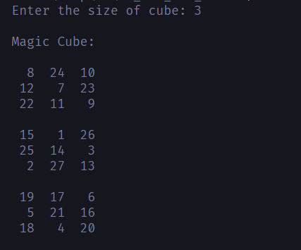

## 3D TIC TAC TOE & MAGIC CUBE

### A. Algorithm to generate 3D Magic Cube:

1. The numbers from 1 to 27 in a magic cube are found to be following a pattern. The function *createMagicCube()* makes use of this pattern to find the next position of insertion each time and thus insert every number at the required position in the magic cube.
2. The position of 1 is found from observation to always lie in a certain position in the cube, and the rest of the numbers follow a pattern which depends on this initial position
3. From observation, it was found that the initial position, that is the position of 1 in the cube, is (n/2, 0, n/2), where n is the size of the cube.
   1. *height* indicates the surface level in the cube- 0 being the highest and n-1 being the lowest.
   1. *row* indicates the row number on each surface- 0 being furthest at the back and n-1 being at the front of the cube.
   1. *col* indicates the column number on each surface- 0 being furthest at the left and n-1 being furthest at the right.
4. The pattern is as follows-
   a. ‘i’ is inserted at the found position in the cube and then incremented, allowing the insertion of all numbers from 1 to n\*n\*n in the cube.
   b. If the required position in the cube is already occupied, from observation it is found that the position is instead shifted to the next surface (lower surface), and the previous row (the row at the back).
   c. If the row, column or height is less than 0, i.e it goes out of bounds and is not valid, it is made to wrap around and come to n-1. Similarly if it becomes greater than n-1, it is made to wrap around and come to 0.
   d. If the required position in the cube is again found to be occupied, from observation it is found that the position is instead shifted to the next column (to the right), and the previous surface (upper surface).
   e. If the row, column or height is less than 0, i.e it goes out of bounds and is not valid, it is made to wrap around and come to n-1. Similarly if it becomes greater than n-1, it is made to wrap around and come to 0.
   f. Once the correct position is found, the current number, which is i, is inserted at this position in the cube.
   g. From observation it is found that the next position is found from the current position- it is shifted to the previous row (the row to the back), and the previous column (to the left).
   1h. If the row, column or height is less than 0, i.e it goes out of bounds and is not valid, it is made to wrap around and come to n-1. Similarly if it becomes greater than n-1, it is made to wrap around and come to 0.

### B. TIC TAC TOE**

#### Global Variables Used :

- *magicCubePosition:* Map data structure used to map the number on the magicCube to its coordinates
- i*nputMap:* Map data structure used to map the positions on a cube (1-27) with the number on the magicCube
- *currBoard*: 3D vector for initializing the game board (initially blank and filled with '-')
- humanWins  & computerWins: Variables to store the count of user and computer wins
- *human* & *computer*: Char variables to initialize the user and computer moves as 'X'/'O' accordingly
- *n*: Size of the magicCube and 3d tic tac toe board initialized to 3
- *humanList* & *computerList*: Stores the number on the magicCube corresponding to the position on the gameBoard according to the user and computer moves. (eg: if the user plays at position 1 the number corresponding to it on the magicCube is 8).
- *humanInputList* & *computerInputList:* Stores the positions of the gameBoard played by the user and computer accordingly.
- *humanLists* and *computerLists*: These are used to store the sequences of 3 numbers played by the user and computer accordingly (number of magicCube corresponding to the positions) which satisfies the conditions for winning (sum = 42 and collinearity of the numbers)
- *turnsCount:* variable that stores the number of moves played and is incremented on every valid move (if totalMoves==27 game is over!)
- *winningPosition*: Variable that is used to stores the position on the gameBoard where the computer need to play so as to win (after passing all the conditions to win)
- *humanCanWin* & *computerCanWin*: Bool variables that store if the user can win or human can win (the values are updated accordingly in the checkCanWin() function)

**Execution-**

1) *int main()*
   - The execution of the program starts from the main function.
   - It calls *createMagicCube()* function to generate the magic cube of order n=3.
   - It then calls the *startGame()* function.

2) *startGame()*
   - This function initializes the game.
   - It displays the rules of the game.
   - It calls the function to *displayIntialBoard()*
   - It then asks the user whether or not they want to play first, and assigns an X to the player going first and an O to the other.
   - It calls *createGameBoard()* function to initialize the board.
   - It calls *humanTurn()* and *computerTurn()* function accordingly
   - The game goes on until either the board is filled, or the user or the computer completes 10 wins.
   - In the end it displays the final score, and declares a winner.

3) *displayIntialBoard()*
   - *displayInitialBoard() is a 3D game board which is displayed in the game rules sections and contains the numbers(positions: 1-27).* 
   - *It is displayed for the user to easily understand how to start the game and where and how to make the next move according to the vacant position on the board.* 

4) *createGameBoard()*
   - Used to initialize a new *gameBoard* before the game begins.
   - It fills the board with '-' which indicates empty places on the board.

5) *humanTurn()*
   - *humanTurn()* is used to complete the user's turn.
      - The vector *humanCoords* is used to store the coordinates of the position entered by the user: 
      - *inputMap* gives the number from the Magic Cube which corresponds to the entered position.
      - *magicCubePosition* then gives a vector which has stored in it the x, y, and z coordinates of this number on the magic cube.
   - If the entered position is already filled, the user is prompted to enter another position.
   - If the entered position is empty, the entered position is added to the list of positions played by the user, and the position is filled on the gameboard.
   - *winCheck()* is called to check whether the user succeeded in making a line after this move. 
   - The current game board is displayed by calling the *displayGameBoard()* function
   - The current number of wins and list of positions played by the user and the computer respectively is displayed.

6) *winCheck()*
   - This function is used to check if there is a win using the list of moves that have been played.
   - The *user* variable is used to determine if the player is human or computer and call the function *makeSubsequences()* which is being used to check if there is a win accordingly.
   - Vector *subarr* is used by the makeSubsequences() function.
   - If the number of moves played is less than order of cube then win is not possible and it exists otherwise it calls *makeSubsequences()* function.

7) *makeSubsequences()*
   - *makeSubsequences()* is a recursive function to generate all possible sequences of order n from the list of moves played and check if their sum is equal to the magic number and if they are collinear using the function *checkLine()* and increment the wins of the player playing. *makeSubsequences()* is called recursively to make all possible subsequences:
      - *index* is used to recursively make subsequences of *ar*r until *index* equals *n*, indicating that all possible subsequences have been made. We recursively keep calling *checkCanWin()*, once without including element at the current *index*, and once including element at current *index* by adding it to *subarr*.
      - vector *arr* is either *computerList* or *humanList-* which contains the numbers on the magic cube corresponding to all the positions that the player has marked.
      - *magicNumber* stores the required sum for each line of the magic cube.
      - *subarr* is used to store the subarr currently being formed.
      - *player* is used to indicate the current player whose list is being checked- whether it's the user or the computer- 0 indicates computer and 1 indicates the user.
      - l variable stores the length of the subsequence.
   - Once *index* equals n, indicating that all the elements of the array have been covered, iIf the size of *subarr* is equal to n, that is it has the number of elements required to make a line and win, there is a possibility that the player could make a line and win a point.
   - To check whether the player won, the sum of the elements of subarr is calculated in the variable *sum.* Since *arr* stored all the numbers on the magic cube corresponding to positions played, *subarr* stores these same numbers.
   - If the sum is equal to the magic number, there is a possibility that the player has made a line and won a point.
   - If the sum is not equal to the magic number, it exits the function as win is not possible.
   - *checkLine()* is called to check if the three positions in the subsequence are collinear. If false is returned, we exit the function as it is not a win.
   - If so, it means that the player has successfully made a line and won.
   - *humanLists* is used to store all the subarrays which have resulted in a line and hence won the player a point.
   - The current position is checked with the existing successful subarrays inserted in *humanLists* and *computerLists* according to the value of *player*, to ensure that it is not already inserted, hence avoiding duplicates.
   - If it does not already exist, it is added to *humanLists* or *computerLists* according to the value of *player* (0=computer, 1-user), and humanWins or computerWins are also accordingly incremented.

8) *checkLine()*
   - *checkLine()* function is basically used to check the collinearity of the three numbers on our magic cube.
   - It takes 3 numbers in order starting from position *(i=0,j=1,k=2)* in our array where all the numbers are stored and keep on incrementing the positions*(i,j,k)* by 1 until we reach the last number in the list.
   - It then finds the coordinates of the chosen 3 numbers from the magic cube (eg. 8 has coordinates (0,0,0) in our magicCube).
   - It stores the x,y,z coordinates respectively in the different variables so as to perform the calculations.
   - It then calculates the distances between the numbers (dist1: dist between number 1 and 2, dist2: dist between 2 and 3, dist 3: distance between 1 and 3)
   - It checks if the sum of dist1 and dist2 is equal to dist3 or not. If yes then the function would return true stating that the chosen three numbers are collinear on the magic cube. If dist1+dist2!=dist3 then function returns false.

9) *displayGameBoard()*
   - Used to the display 3D game board layer-wise according to the 3 layers of the cube.(Layer 1, Layer 2, Layer 3)

10) *computerTurn()*
   - This function is used to decide the position to be played by the computer and mark it on the board using the *goMake()* function.
   - If the number of turns checked by variable *turnsCount* is just 1 then *make\_2()* function is called.
   - The vector *subarr* is used by the function *checkCanWin()* to determine if winning is possible.
   - The variables *humanCanWin* and *computerCanWin* are used to keep track if winning is possible.
   - The computer first checks if it can win by calling *checkCanWin()* and plays on that position if true is returned.
   - Otherwise it checks if the user can win by calling *checkCanWin* and blocks that position if true is returned.
   - Else it calls *make\_2()* and marks the most favourable position.

1) *make\_2()*
   - This function checks if the position is empty or not by calling *check()* function. If true is returned i.e. it's empty, it returns that position.In case, the position is filled it checks for the next position.
   - It first checks for the center position of the cube.
   - It then checks for the 8 extreme corner positions of the cube.
   - It then checks for the remaining positions starting from the top surface and moving to the bottom one.

11) *check()*
   - This function is used to check if the position *pos* passed as a parameter to the array is empty or not.
   - *checkCoords* vector contains the coordinates of the number(*pos*) according to the magic cube. 
   - If the position on board is marked '-' i.e. its empty the function returns true.Else, it returns false

12) *goMake()*
   - *goMake()* is used to fill the position required by the computer.The position passed to the function is added to the list of positions played by the computer, and the position is filled on the *gameboard*.
      - The vector *compCoords* is used to store the coordinates of the position passed by the computer.
      - *inputMap* gives the number from the Magic Cube which corresponds to the position.
      - *magicCubePosition* then gives a vector which has stored in it the x, y, and z coordinates of this number on the magic cube.
      - *computerList* stores all the numbers on the magic cube corresponding to the positions filled by the computer.
   - *winCheck()* is called to check whether the computer succeeded in making a line after this move.
   - The current gameboard is displayed, and the current number of wins and list of positions played by the user and the computer respectively is displayed.

13) *checkCanWIn()*
   - *checkCanWin()* is used to check whether there is any position which would allow the player to win.It is called recursively to make all possible subsequences
      - *magicNumber* stores the required sum for each line of the magic cube.
      - *arr* is the passed vector- either *computerList* or *humanList*- which contains the numbers on the magic cube corresponding to all the positions that the player has marked.
      - *index* is used to recursively make subsequences of arr until *index* equals *n*, indicating that all possible subsequences have been made. We recursively keep calling *checkCanWin()*, once without including element at the current *index*, and once including element at current i*ndex* by adding it to *subarr.*
      - *subarr* is used to store the subsequence currently being formed.
      - *player* is used to indicate the current player whose list is being checked- whether it's the user or the computer- 0 indicates computer and 1 indicates the user.
   - Once *index* equals n, indicating that all the elements of the array have been covered, if the size of *subarr* is equal to n-1, that is it has one element less than the number required to make a line and win, there is a possibility that one more move could enable the player to win.
   - To check for the required position to win, the sum of the elements of *subarr* is calculated. Since *arr* stored all the numbers on the magic cube corresponding to positions played, *subarr* stores these same numbers.
   - If the difference between the above sum and *magicNumber* lies is something from 1 to 27, it means that there is a possibility that there is a position which the player could mark to make a line. If this is false both *computerCanWin*  and *humanCanWin* are made to be false.
   - *diffCoords* is used to store the corresponding x, y and z coordinates of this number on the cube.
   - If the position is not already taken, the next thing to check is if these numbers would form a line.To do so, *subarr* is copied to a duplicate vector, in which diff is also pushed.
   - *checkLine()* is called to check whether the subarr along with diff together form a line.
   - If so, it means that the player can make a move on this position to win a point. Accordingly, the variable *computerCanWin* or *humanCanWin* is made to be true, depending on the value of the player.
   - *inputMap* is used to check the corresponding position from the number on the magic cube. This position is the next winning position for the player on the gameboard, and is hence stored in the variable *winningPosition*.

**Output Screenshots:**

1) Magic Cube

1) 3D Tic Tac Toe

- Rules

- Game in Progress

- Result on Game Completion

